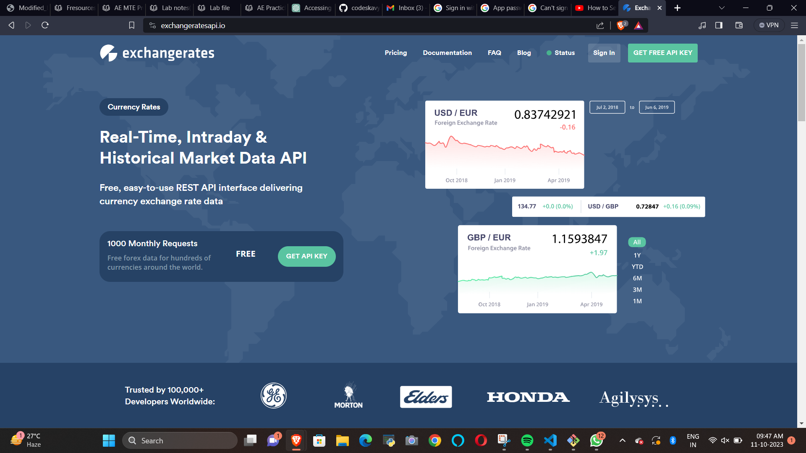
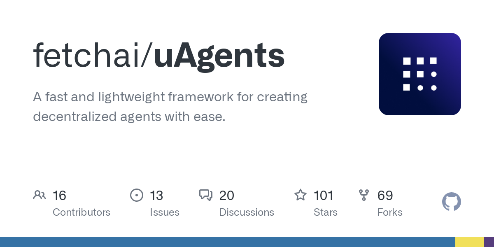

# Hack-AI
PROJECT NAME:CuRRENCY EXCHANGE MONITOR AND ALERT AGENT(using uagents)

DESCRIPTION OF THE PROJECT:
1.SETS BASE CURRENCY: The user sets the base currency which is (EUR) in our project.

2.SETS FOREIGN CURERNCY:The user sets one or more foreign currency in which it wants to convert.

3.CONNECTS TO API:It connects to a real time api whose key and url has been provided in the code for getching the real-time exchange rates.

4.SETS THRESHOLD VALUE:Inputs the threshold value from the user for the selected currencies.

5.FOREIGN CURRENCIES:stores the codes and the currency name as a csv file.

6.COMPARISON:Compares the currency inputted by the user with the currency code stored in the csv file.

7.MYSQ:Uses mysql to stores details of the user i.e. user_email,username,password and the DOB.

8.THRESHOLD PROMPAT:sends the prompt to the user when the value of the exchange rate surpasses a particular threshold using mail.

9.Uagents-Runs the code after a specific interval of time and when it reaches above the threshold sends prompt or alert.

INSTRUCTIONS TO RUN THE PROJECT:
-To create a poetry env.
-Create a file of the API key (api_.txt) in the folder currency in agents in src
-Enter sender's email id ,email password in config_email.py
-Enter Mysql password in congif.py file
-Need to create an application password.
-two step verification.
-enable less secure app settings.
- add app passwrod in config_email.py

SPECIAL CONSIDERATIONS(IF ANY):

